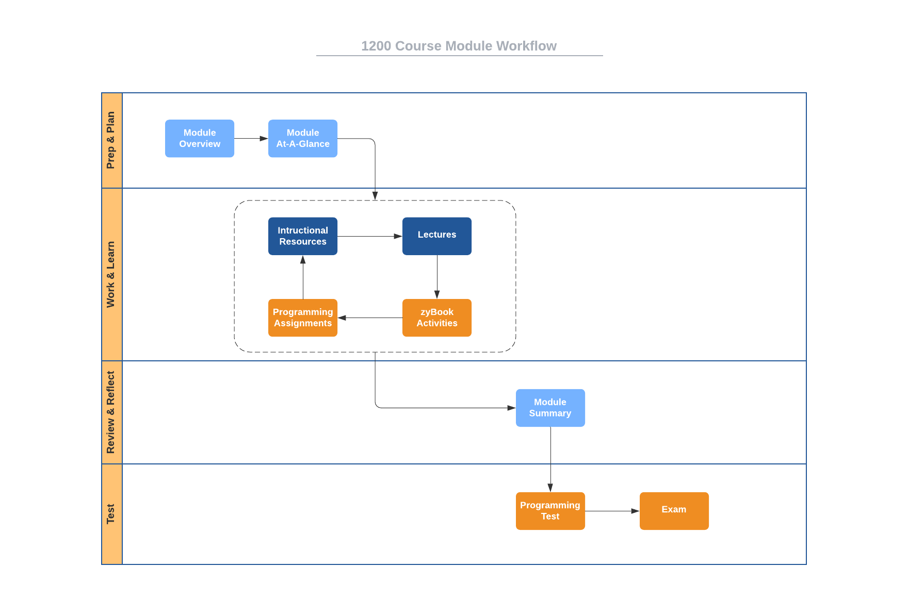

# Course Structure

This course is organized into eight modules numbered
[zero](https://www.cs.utexas.edu/users/EWD/transcriptions/EWD08xx/EWD831.html)
through seven. Module 0 is an introductory "getting started" module, while
Module 1 through Module 6 are course-content modules. Rather than being
organized strictly by content, these modules are
[timeboxed](https://en.wikipedia.org/wiki/Timeboxing); that is, M1 -- M6 are
of fixed, equal durations with specific tasks to be completed within each. (If
you're familiar with 
[agile methods](https://en.wikipedia.org/wiki/Agile_software_development),
you'll recognize similarities to
[Scrum](https://en.wikipedia.org/wiki/Scrum_(software_development)) sprints.)

Scheduling, planning, and knowing when things are due are easy with timeboxed
modules. All graded items are scheduled to be due or delivered on module
boundaries. Specifically:

- Each activity is due on the last day of the module that contains it.
- Each exam is given immediately after the last day of the module that contains it.
- Each programming test is given immediately after the last day of the module that contains it.

This overall course structure is the same regardless of course delivery mode
(in-person or online). Module 0 begins on the first day of classes for the term and ends on the first Sunday
of the term. Each module 1-6 begins on a Monday and ends on a Sunday. The
duration of each module 1-6 is typically 14 days, excluding holidays.

Here is the specific schedule for [Spring 2022](http://www.auburn.edu/main/auweb_calendar.php).

Module | Begin | End
------ | ----- | ---
M0 | Tue 16 Aug  | Sun 21 Aug
M1 | Mon 22 Aug  | Sun 3 Sept
M2 | Mon 6 Sept  | Sun 18 Sept
M3 | Mon 26 Sept | Sun 9 Oct
M4 | Mon 10 Oct  | Sun 23 Oct
M5 | Mon 31 Oct  | Sun 13 Nov
M6 | Mon 14 Nov  | Fri 2 Dec

Module 6 has less content to account for final exam preparation and other end
of term issues.

# Module Structure

Each of the seven content modules has the same structure with the following components.

- **Module Overview:** A brief introduction to the module content.
- **Module At-A-Glance:** A more complete description of the module focus, tips for success, and learning objectives.
- **Instructional Resources:** Links to the complete course eBook and references to associated readings and activities from the eBook.
- **Lectures:** Links to complete videos of lecture sessions.
- **Participation Activities:** Activities from the eBook designed to help you put into practice some of the topics being presented.
- **Challenge Activites:** Activities that have you demonstrate your ability to solve problems and implement solutions on your own.
- **Summary:** A brief recap of what was covered in the module.

In addition to these common elements, following Module 2, 4, and 6, there will be:

- **Programming Test:** A timed programming test that requires you to implement software solutions for small, focused problems. These tests are designed to measure your ability to solve small problems quickly. Doing this requires that you have internalized and mastered basic problem solving skills, basic programming skills, and appropriate language knowledge. A programming test is very much a test of your *fluency*.
- **Exam:** A timed Canvas quiz that tests your overall mastery of the content in the current module and one or more previous modules.

# Workflow

Since each content module has the same structure, you can apply the same process to going through each. Here is a suggested [workflow](https://en.wikipedia.org/wiki/Workflow) for going through each module of this course.

Notice the iterative nature of the items in the *Work & Learn*
[swimlane](https://en.wikipedia.org/wiki/Swim_lane). Rather than going through
this portion of the module sequentially, I strongly encourage you to take an
[iterative](https://en.wikipedia.org/wiki/Iteration) approach. Read a portion
of the eBook, engage with Participation Activities, watch the associated
lecture videos, engage with a Challenge Activity, and so on. Although graded
items are not due until the end of a module, I strongly encourage you to start
work early, applying the workflow above consistently each day rather than trying
to get everything done at once near the deadline.

